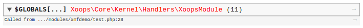
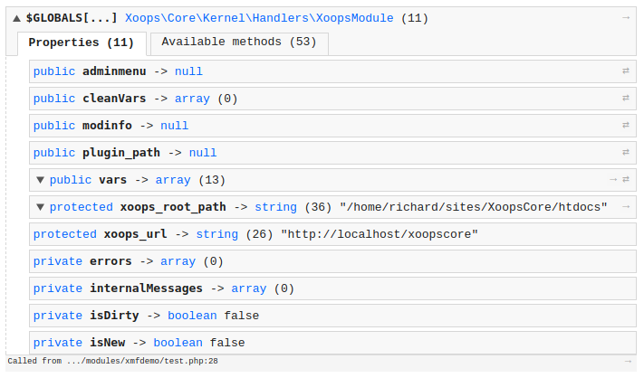

# Debugging

When you are coding, things happen. When code goes live, things happen. Sometime, when those things happen it isn't practical, or in some cases even possible, to use XDebug in a fancy IDE. The old fashioned, light weight approach of echoing variables from deep inside the code comes to the rescue. But, echo and var\_export have are not the most friendly or productive tools. This is where `Xmf\Debug` is your friend.

```php
    \Xmf\Debug::dump($GLOBALS['xoopsModule']);
```

Output this when executed:



Clicking on the dump line opens it:



You can dump multiple variable in one line:

```php
    \Xmf\Debug::dump($counter, $output, $handler);
```

Need to take a look at your inputs?

```php
    \Xmf\Debug::dump($_POST);
```

How did we get here?

```php
    \Xmf\Debug::backtrace();
```

Always there, Xmf\Debug can be a handy tool to keep in mind.

